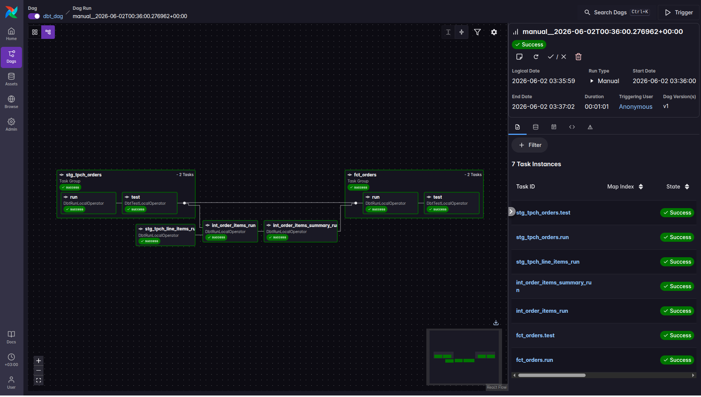

# 🚀 dbt + Airflow + Snowflake Data Pipeline

An end-to-end ELT pipeline using **dbt** for data transformation, **Apache Airflow** (via Astronomer Cosmos) for orchestration, and **Snowflake** as the data warehouse. The pipeline processes TPC-H sample data into analytics-ready fact tables.


---
## 📋 Table of Contents

- [Project Structure](#Project_Structure)
- [Prerequisites](#Prerequisites)
- [Setup](#Setup)
- [Data Models](#Data_Models)
- [Macros](#Macros)
- [Testing](#Testing)
- [Dependencies](#Dependencies)
- [Airflow DAG](#RAirflow_DAG)
- [Teardown](#Teardown)
- [License](#License)
- [Contact](#Contact)
---

## 🗂️ Project Structure

```
data_pipeline/
├── dags/
│   ├── dbt/
│   │   └── dbt_pr/
│   │       ├── models/
│   │       │   ├── staging/          # Source definitions & staging models
│   │       │   └── marts/            # Intermediate & fact models
│   │       ├── macros/               # Reusable SQL macros
│   │       ├── tests/                # Singular data tests
│   │       └── dbt_project.yml
│   └── dbt_dag.py                    # Airflow DAG definition
├── Dockerfile
├── requirements.txt
└── packages.txt
```

---

## ⚙️ Prerequisites

- [Docker](https://www.docker.com/) & Docker Compose
- [Astronomer CLI](https://docs.astronomer.io/astro/cli/install-cli)
- A Snowflake account
- Python 3.8+

---

## 🏗️ Setup

### 1. Snowflake Configuration

Run the following in your Snowflake worksheet to provision the required resources:

```sql
use role accountadmin;

create warehouse dbt_wh with warehouse_size='x-small';
create database if not exists dbt_db;
create role if not exists dbt_role;

grant role dbt_role to user <your_snowflake_user>;
grant usage on warehouse dbt_wh to role dbt_role;
grant all on database dbt_db to role dbt_role;

use role dbt_role;
create schema if not exists dbt_db.dbt_schema;
```

### 2. Configure dbt Profile

Update `dags/dbt/dbt_pr/dbt_project.yml` with your warehouse settings:

```yaml
models:
  dbt_pr:
    staging:
      materialized: view
      snowflake_warehouse: dbt_wh
    marts:
      materialized: table
      snowflake_warehouse: dbt_wh
```

### 3. Install Dependencies & Start Airflow

```bash
# Install Astronomer CLI (if not already installed)
brew install astro   # macOS

# Start the local Airflow environment
astro dev start
```

### 4. Add Snowflake Connection in Airflow UI

Navigate to **Admin → Connections** and add a new connection:

| Field | Value |
|---|---|
| Connection ID | `snowflake_conn` |
| Connection Type | `Snowflake` |
| Account | `<account_locator>-<account_name>` |
| Login | `<your_username>` |
| Password | `<your_password>` |
| Extra | `{"warehouse": "dbt_wh", "database": "dbt_db", "role": "dbt_role"}` |

---

## 🔄 Data Models

### Staging Layer (`models/staging/`)

| Model | Description | Materialization |
|---|---|---|
| `stg_tpch_orders` | Cleaned orders from TPC-H source | View |
| `stg_tpch_line_items` | Line items with surrogate key generated via `dbt_utils` | View |

### Marts Layer (`models/marts/`)

| Model | Description | Materialization |
|---|---|---|
| `int_order_items` | Joins orders with line items; applies discount macro | Table |
| `int_order_items_summary` | Aggregates gross sales and discount amounts per order | Table |
| `fct_orders` | Final fact table combining orders with item summaries | Table |

---

## 🧰 Macros

**`macros/pricing.sql`** — `discounted_amount(extended_price, discount_percentage, scale=2)`

Calculates the discounted value of a line item:

```sql

    (-1 * {{extended_price}} * {{discount_percentage}})::decimal(16, {{ scale }})

```

---

## ✅ Testing

### Generic Tests (`models/marts/generic_tests.yml`)

- `fct_orders.order_key` — unique, not null, valid relationship to staging
- `fct_orders.status_code` — accepted values: `P`, `O`, `F`

### Singular Tests (`tests/`)

| Test | Description |
|---|---|
| `fct_orders_date_valid.sql` | Flags orders with dates in the future or before 1990 |
| `fct_order_discount.sql` | Flags orders where item discount is unexpectedly positive |

Run all tests:

```bash
dbt test
```

---

## 📦 Dependencies

**`packages.yml`**

```yaml
packages:
  - package: dbt-labs/dbt_utils
    version: [">=1.0.0", "<2.0.0"]
```

Install packages:

```bash
dbt deps
```

**`requirements.txt`**

```
astronomer-cosmos
apache-airflow-providers-snowflake
```

---

## 🛩️ Airflow DAG

The `dbt_dag.py` DAG uses [Astronomer Cosmos](https://github.com/astronomer/astronomer-cosmos) to automatically generate task-level Airflow tasks from your dbt project.



- **Schedule:** Daily (`@daily`)
- **Start Date:** 2023-09-10
- **Catchup:** Disabled

The dbt executable runs inside an isolated virtual environment (`dbt_venv`) created in the Docker image to avoid dependency conflicts with Airflow.

---

## 🧹 Teardown

To remove Snowflake resources when done:

```sql
use role accountadmin;

drop warehouse if exists dbt_wh;
drop database if exists dbt_db;
drop role if exists dbt_role;
```

To stop the local Airflow environment:

```bash
astro dev stop
```


## 📄 License

This project is licensed under the **MIT License** — see the [LICENSE](LICENSE) file for details.

---

## 📬 Contact

|                  | Contact                              |
|------------------|--------------------------------------|
| LinkedIn         | [Abanob Melk](https://www.linkedin.com/in/abanob-melk/) |
| Email            | AbanobAshraf220@gmail.com            |

---

<p align="center">
  Built with ❤️ by Abanob Ashraf
</p>
